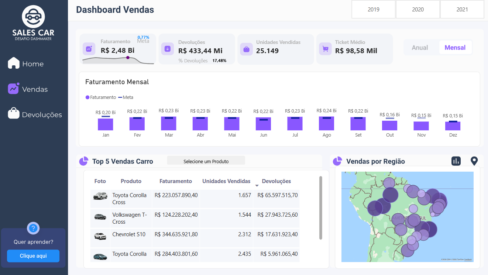

# projeto-powerbi-sql
Projeto desenvolvido como parte da minha formação em Análise de Dados pela Xperiun.

## 🛠️ Ferramentas utilizadas

- Power BI
- Power Query
- DAX

## 🎯 Objetivo

Analisar os dados e desenvolver um dashboard interativo para acompanhamento dos principais indicadores.

## 📈 Dashboard

## 📚 Aprendizados

Durante o projeto, pratiquei conceitos de tratamento e transformação de dados, modelagem, criação de medidas em DAX e construção de dashboards no Power BI.
